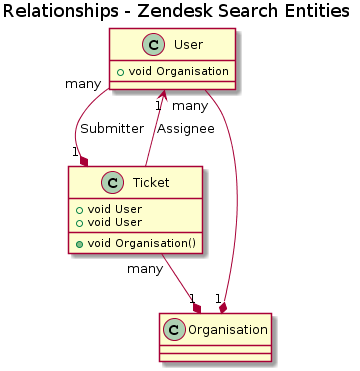

# Zendesk Search

###### Author: Harsain Kapoor (harsain@gmail.com)

---
### Design

Have used Spring Shell framework to create this shell application.
Spring Shell provides infrastructure to create REPL (Read, Evaluate, Print, Loop), allowing us to concentrate on the business logic.



___

#### Available commands:

- ###### Help
````bash
Zendesk-search:>help
AVAILABLE COMMANDS

Built-In Commands
        clear: Clear the shell screen.
        exit, quit: Exit the shell.
        help: Display help about available commands.
        script: Read and execute commands from a file.

List Fields Command
        list: Lists all the possible fields available to search on

Organisation Search Command
        organisation-search: Organisation field search

Search Command
        search: Search

Ticket Search Command
        ticket-search: Ticket field search

User Search Command
        user-search: User Search Field
````

- ###### Clear
````bash
Zendesk-search:>clear
````

- ###### Quit / Exit (Super important to know how to QUIT)
````bash
quit
````
_OR_
```bash
exit
```

- ###### List
````bash
Zendesk-search:>list
---------------------------------------- USER -------------------------------------------------
_id
shared
last_login_at
role
signature
timezone
verified
created_at
active
external_id
locale
url
suspended
tags
phone
organization_id
name
alias
email
---------------------------------------- ORGANISATION -------------------------------------------------
_id
shared_tickets
name
created_at
external_id
details
url
domain_names
tags
---------------------------------------- TICKETS -------------------------------------------------
_id
subject
created_at
description
submitter_id
external_id
type
priority
url
tags
via
organization_id
due_at
has_incidents
status
assignee_id
````

- ###### user-search --key --value
````bash
Zendesk-search:>user-search _id 1
[ {
  "_id" : "1",
  "shared" : "false",
  "last_login_at" : "2013-08-04T01:03:27 -10:00",
  "role" : "admin",
  "signature" : "Don't Worry Be Happy!",
  "timezone" : "Sri Lanka",
  "verified" : "true",
  "created_at" : "2016-04-15T05:19:46 -10:00",
  "active" : "true",
  "external_id" : "xxxxxxx-xxxx-xxxx-xxxx-xxxxxxxxxxxx",
  "locale" : "en-AU",
  "url" : "http://xxxxxx.com/api/v2/users/1.json",
  "suspended" : "true",
  "tags" : [ "Springville", "Sutton", "Hartsville/Hartley", "Diaperville" ],
  "phone" : "8335-422-718",
  "organisationObj" : {
    "_id" : "119",
    "shared_tickets" : "false",
    "name" : "Multron",
    "created_at" : "2016-02-29T03:45:12 -11:00",
    "external_id" : "xxxxxxx-xxxx-xxxx-xxxx-xxxxxxxxxxxx",
    "details" : "Non profit",
    "url" : "http://xxxxxx.com/api/v2/organizations/119.json",
    "domain_names" : [ "bleeko.com", "pulze.com", "xoggle.com", "sultraxin.com" ],
    "tags" : [ "Erickson", "Mccoy", "Wiggins", "Brooks" ]
  },
  "name" : "xxxxxx xxx",
  "alias" : "Miss xxxxxx",
  "email" : "xxxxxxx@xxxxx.com"
} ]
````

- ###### organisation-search --key --value
````bash
Zendesk-search:>organisation-search _id 101
[ {
  "_id" : "101",
  "shared_tickets" : "false",
  "name" : "XXXXXXX",
  "created_at" : "2016-05-21T11:10:28 -10:00",
  "external_id" : "xxxxxxx-xxxx-xxxx-xxxx-xxxxxxxxxxxx",
  "details" : "XXXXXXX",
  "url" : "http://xxxxxxxx.com/api/v2/organizations/101.json",
  "domain_names" : [ "kage.com", "ecratic.com", "endipin.com", "zentix.com" ],
  "tags" : [ "Fulton", "West", "Rodriguez", "Farley" ]
} ]
````

- ###### ticket-search --key --value
````bash
Zendesk-search:>ticket-search _id xxxxxxx-xxxx-xxxx-xxxx-xxxxxxxxxxxx
[ {
  "_id" : "xxxxxxx-xxxx-xxxx-xxxx-xxxxxxxxxxxx",
  "subject" : "Lorem ipsum",
  "created_at" : "2016-04-28T11:19:34 -10:00",
  "description" : "Lorem ipsum",
  "submitterUser" : {
    "_id" : "38",
    "shared" : "true",
    "last_login_at" : "2012-12-20T01:48:00 -11:00",
    "role" : "agent",
    "signature" : "Don't Worry Be Happy!",
    "timezone" : "Gibraltar",
    "verified" : "false",
    "created_at" : "2016-01-31T02:46:05 -11:00",
    "active" : "false",
    "external_id" : "72c7ba23-e070-4583-b701-04a038a28b02",
    "locale" : "en-AU",
    "url" : "http://xxxxxxxxx.com/api/v2/users/38.json",
    "suspended" : "true",
    "tags" : [ "Colton", "Williamson", "Marshall", "Charco" ],
    "phone" : "xxxx-xxx-xxx",
    "organization_id" : "114",
    "name" : "xxxx xxxx",
    "alias" : "Mr xxxxx",
    "email" : "xxxxxxx@xxxxxx.com"
  },
  "external_id" : "xxxxxxx-xxxx-xxxx-xxxx-xxxxxxxxxxxx",
  "type" : "incident",
  "priority" : "high",
  "url" : "http://xxxxxx.com/api/v2/tickets/436bf9b0-1147-4c0a-8439-6f79833bff5b.json",
  "tags" : [ "Ohio", "Pennsylvania", "American Samoa", "Northern Mariana Islands" ],
  "via" : "web",
  "organization" : {
    "_id" : "116",
    "shared_tickets" : "false",
    "name" : "xxxx",
    "created_at" : "2016-01-13T09:34:07 -11:00",
    "external_id" : "xxxxxxx-xxxx-xxxx-xxxx-xxxxxxxxxxxx",
    "details" : "Artisan",
    "url" : "http://xxxxx.com/api/v2/organizations/116.json",
    "domain_names" : [ "datagene.com", "exoteric.com", "beadzza.com", "digiprint.com" ],
    "tags" : [ "Schneider", "Hoover", "Wilcox", "Hewitt" ]
  },
  "due_at" : "2016-07-31T02:37:50 -10:00",
  "has_incidents" : "false",
  "status" : "pending",
  "assigneeUser" : {
    "_id" : "24",
    "shared" : "false",
    "last_login_at" : "2013-05-11T10:41:04 -10:00",
    "role" : "agent",
    "signature" : "Don't Worry Be Happy!",
    "timezone" : "Cameroon",
    "verified" : "false",
    "created_at" : "2016-03-02T03:35:41 -11:00",
    "active" : "false",
    "external_id" : "xxxxxxx-xxxx-xxxx-xxxx-xxxxxxxxxxxx",
    "locale" : "zh-CN",
    "url" : "http://xxxxxx.com/api/v2/users/24.json",
    "suspended" : "false",
    "tags" : [ "Kieler", "Swartzville", "Salvo", "Guthrie" ],
    "phone" : "9855-882-406",
    "organization_id" : "110",
    "name" : "xxx xxx",
    "alias" : "Miss xxxx",
    "email" : "xxxxxx@xxxxxx.com"
  }
} ]
````

- ###### search
````bash
Zendesk-search:>search
Please enter new user data:
Entity [user, organisation, ticket]: user
ENTITY TO SEARCH: user
Entity: user key: _id
ENTITY: user KEY: _id, VALUE: 1
[ {
  "_id" : "1",
  "shared" : "false",
  "last_login_at" : "2013-08-04T01:03:27 -10:00",
  "role" : "admin",
  "signature" : "Don't Worry Be Happy!",
  "timezone" : "Sri Lanka",
  "verified" : "true",
  "created_at" : "2016-04-15T05:19:46 -10:00",
  "active" : "true",
  "external_id" : "xxxxxxx-xxxx-xxxx-xxxx-xxxxxxxxxxxx",
  "locale" : "en-AU",
  "url" : "http://xxxxxxxx.com/api/v2/users/1.json",
  "suspended" : "true",
  "tags" : [ "Springville", "Sutton", "Hartsville/Hartley", "Diaperville" ],
  "phone" : "xxxx-xxx-xxx",
  "organisationObj" : {
    "_id" : "119",
    "shared_tickets" : "false",
    "name" : "Multron",
    "created_at" : "2016-02-29T03:45:12 -11:00",
    "external_id" : "xxxxxxx-xxxx-xxxx-xxxx-xxxxxxxxxxxx",
    "details" : "Non profit",
    "url" : "http://xxxxxx.com/api/v2/organizations/119.json",
    "domain_names" : [ "bleeko.com", "pulze.com", "xoggle.com", "sultraxin.com" ],
    "tags" : [ "Erickson", "Mccoy", "Wiggins", "Brooks" ]
  },
  "name" : "xxxx xxxxx",
  "alias" : "Miss xxxx",
  "email" : "xxxxxxx@xxxxxx.com"
} ]
````


----
#### Steps to run the application:
___
###### _Prerequisites_
- Java
- Docker
---

- 1 Clean and install dependencies, will run tests as well
```bash
./mvnw clean install
```

- 2 Compile and package the code
```bash
./mvnw compile package
```

- 3 Run the application
```bash
./mvnw spring-boot:run
``` 
###### _OR_
if you have docker
```bash
docker run -it zendesk-search:0.0.1-SNAPSHOT
```


#### Run Tests

```bash
./mvnw test
```
#### Coverage tests report:
_`open the below mentioned file in a web browser`_

```bash
open target/site/jacoco/index.html
```

#### Generation of Docs
```bash
./mvnw clean javadoc:javadoc
```

#### View Java docs
_`open the below mentioned file in a web browser`_
```bash
open target/site/apidocs/index.html
```
___

#### Scope of further improvements

